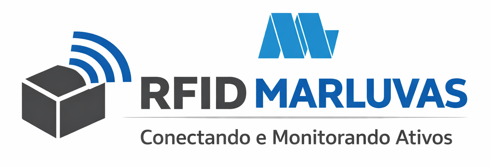

<div align="center">

<!-- 🖼️ BANNER PRINCIPAL
     Arquivo: Images/banner.png
     Tamanho recomendado: 1500 x 600 px (proporção 5:2)
     Sugestão de tema: ambiente digital escuro, tons de azul/ciano, elementos sutis de
     código, fluxos de dados e caixas/etiquetas (referência à logística). Sem texto na imagem. -->


<br><br>

# Filipe Silveira

**Desenvolvedor Backend** · Node.js · TypeScript · C#

*Da logística ao código: construindo sistemas que resolvem problemas reais de operação.*

<br>

[](https://www.linkedin.com/in/filipesilveira-dev/)
[](mailto:contato@filipesilveira.dev)


</div>

---

## 👨‍💻 whoami

```ts
const filipe = {
  cargo: "Desenvolvedor Backend",
  localizacao: "Minas Gerais, Brasil 🇧🇷",
  background: "Logística & Suprimentos (SAP S/4HANA · MM)",
  foco: [
    "APIs REST com Node.js, Express e TypeScript",
    "Banco de dados relacional (SQL e PostgreSQL)",
    "Documentação de APIs com Swagger",
  ],
  formacao: {
    graduacao: "Tecnólogo em Análise e Desenvolvimento de Sistemas (concluído)",
    posGraduacao: "Engenharia de Software (previsão: 07/2027)",
  },
  objetivo: "Primeira oportunidade como desenvolvedor (estágio ou júnior)",
  status: "Aberto a oportunidades 🟢",
};
```

## 🧭 Sobre mim

Sou **Assistente de Logística Sênior em transição para a área de Tecnologia**. Sou recém-formado em Análise e Desenvolvimento de Sistemas e cursando pós-graduação em Engenharia de Software.

Minha base está em **logística, análise de estoque, processos e fluxos de trabalho**. Tenho experiência com **SAP S/4HANA, no módulo MM (Material Management)**, atuando no almoxarifado como **Key-User** em projetos e como executor de testes de hotfix e updates.

Essa vivência me deu capacidade analítica para lidar com **grandes volumes de dados** e foco em **resolução de problemas**. Aqui no GitHub eu compartilho projetos, estudos e experiências da minha evolução no universo da TI.

### O que levo da logística para o código

- **Visão de processo:** entendo o problema de negócio antes de pensar na solução técnica.
- **Rotina de homologação:** já executei testes de hotfix e updates, então sei o valor de validar antes de publicar.
- **Dados no dia a dia:** estou acostumado a analisar grandes volumes de informação e tirar decisões deles.

---

## 🛠️ Tecnologias

**Linguagens**

[](#)

**Back-end**

[](#)

**Bancos de dados**

[](#)

**Front-end (base)**

[](#)

**Ferramentas**

[](#)

---

## 🚀 Projetos em destaque

<table>
  <tr>
    <td width="50%" valign="top">
      
      <h3>🎮 Minecraft Tracker</h3>
      <p>Contador de horas jogadas de Minecraft com gráficos de estatísticas. Criado como projeto de aprendizado de C#.</p>
      <p><b>Stack:</b> C# · SQLite</p>
      <p><a href="https://github.com/FilipeSilvDev/MinecraftTracker">Ver repositório →</a></p>
    </td>
    <td width="50%" valign="top">
      
      <h3>🏷️ RFID Almoxarifado</h3>
      <p>Projeto-base para o setor de TI da empresa, voltado à impressão e ao uso de etiquetas RFID no controle de ativos do almoxarifado.</p>
      <p><b>Foco:</b> Logística · Controle de ativos · RFID</p>
      <p><a href="https://github.com/FilipeSilvDev/RFID-Almoxarifado-Marluvas">Ver repositório →</a></p>
    </td>
  </tr>
</table>

---

## 🎓 Formação

| | Curso | Status |
|---|---|---|
| 🎓 **Graduação** | Tecnólogo em Análise e Desenvolvimento de Sistemas | ✅ Concluído |
| 📚 **Pós-graduação** | Engenharia de Software | 🔄 Em andamento (previsão: 07/2027) |
| 💻 **Cursos online** | Desenvolvimento Web (HTML, CSS, JavaScript e Bootstrap) | ✅ Concluído |

---

## 🎯 Objetivo

Busco minha **primeira oportunidade como desenvolvedor**, onde eu possa aplicar o que já sei, evoluir tecnicamente e contribuir com o projeto e com a equipe.

---

## 📊 Estatísticas do GitHub

<p align="center">
  
  
</p>

---

## 📫 Contato

<p align="center">
  <a href="mailto:contato@filipesilveira.dev">contato@filipesilveira.dev</a>
  &nbsp;·&nbsp;
  <a href="https://www.linkedin.com/in/filipesilveira-dev/">LinkedIn</a>
</p>

<p align="center"><sub>Feito com ☕ e muita curiosidade.</sub></p>